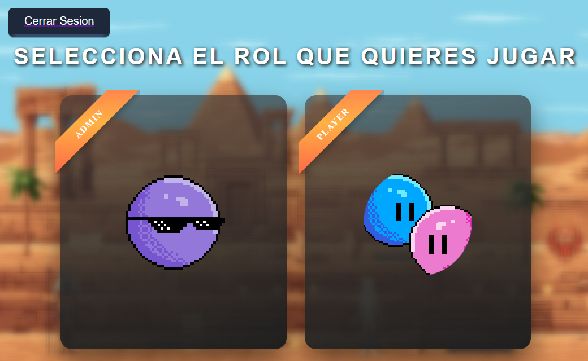
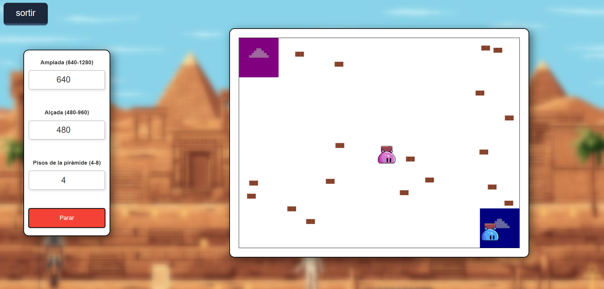
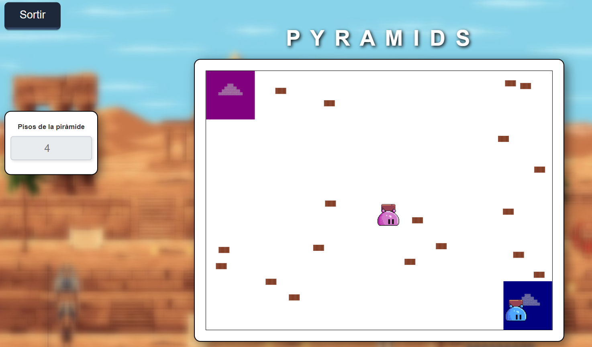

Este es un proyecto colaborativo que hice durante el ciclo formativo de Desarrollo de Aplicaciones Web junto a @mlopezsapalomera

## 🔤 Descripción 

El proyecto consiste en un juego de piramides multijugador con dos equipos: Azul y Rosa. Cada equipo tiene una piramide de 4-6 niveles configurable por el administrador. El objetivo es recoger ladrillos del mapa que se generan aleatoriamente y llevarlos a tu zona para construir tu piramide antes que el otro equipo. 

Nos dieron una semana para llevar a cabo todo.

## 📌 Funcionalidades implementadas por mi

- La estructura de carpetas y la configuracion del router
- Sprites de los ladrillos y los personajes
- El handler de WebSocket para manejar los eventos del juego y que usaría mi compañero
- El movimiento de los personajes
- Autenticación con google (aunque ha sido desactivada en este fork)

> [!IMPORTANT]  
> Al ser un proyecto pensado para que solo las personas con el correo de la institucion puedan jugar, he decidido que deshabilitar la autenticacion.
> Para poder jugar con mas personas es necesaria una red lan como la de hamachi

